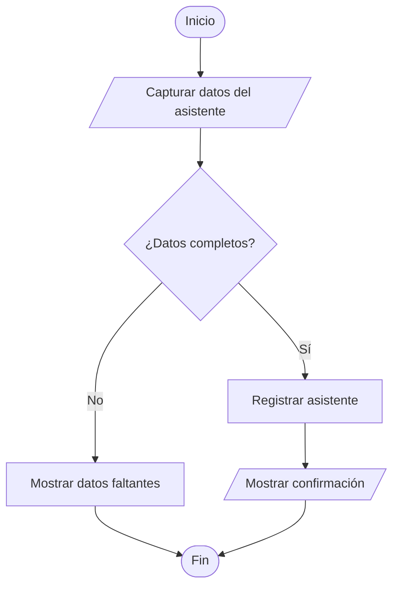

```mermaid
flowchart TD

    A([Inicio]) --> B[/Capturar datos del asistente/]

    B --> C{¿Datos completos?}

    C -->|Sí| D[Registrar asistente]

    D -->F[/Mostrar confirmación/]

    C -->|No| E[Mostrar datos faltantes]

    E -->G([Fin])

    F --> G
```