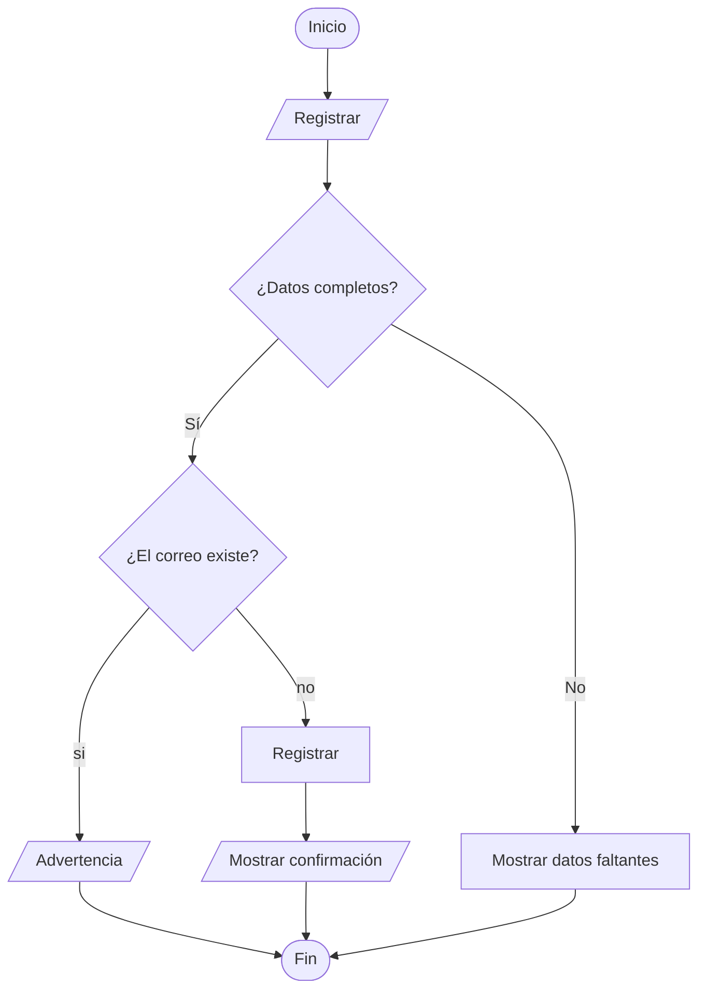

```mermaid
flowchart TD
    A([Inicio]) --> B[/Registrar/]
    B --> C{¿Datos completos?}
    C -->|Sí| D{¿El correo existe?}
    D -->|si| H[/Advertencia/]
    H --> G
    D -->|no| I[Registrar]
    I -->F[/Mostrar confirmación/]
    C -->|No| E[Mostrar datos faltantes]
    E -->G([Fin])
    F --> G
```